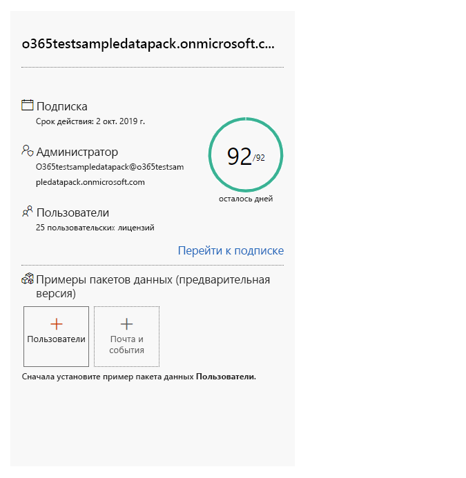
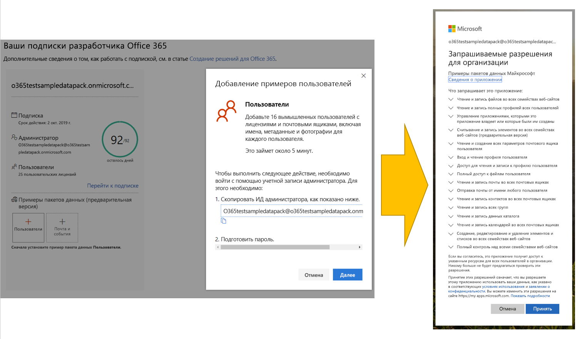
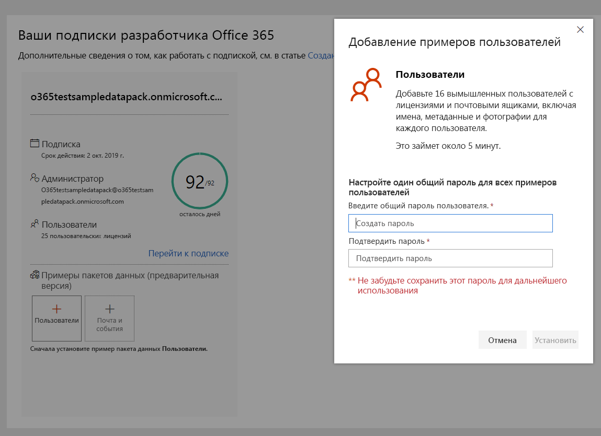
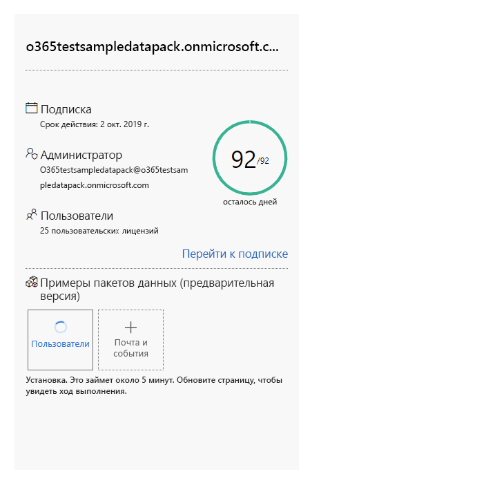
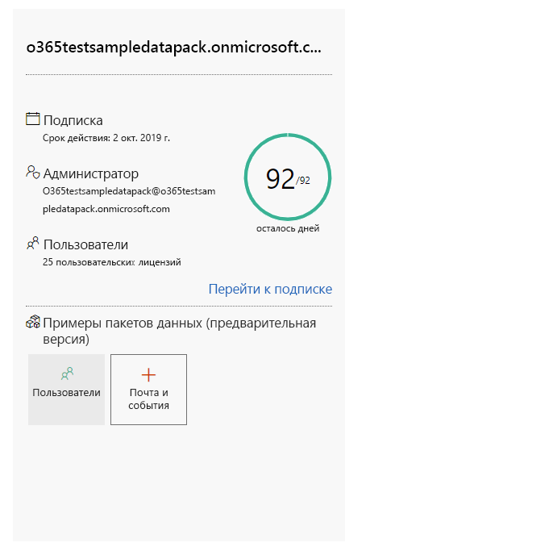
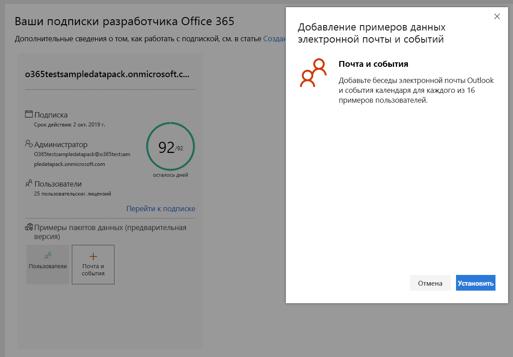
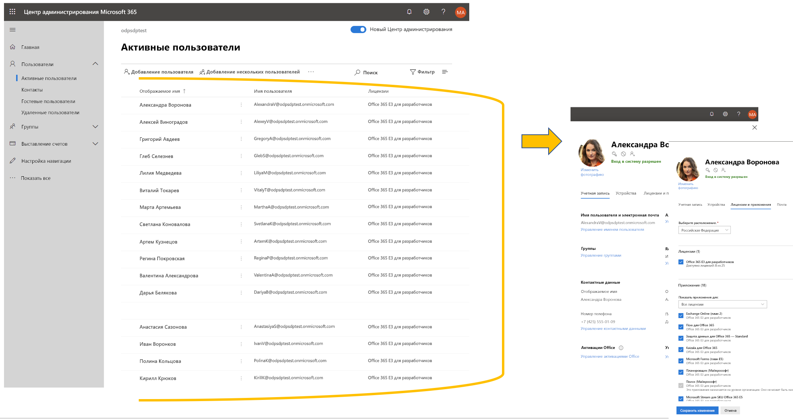
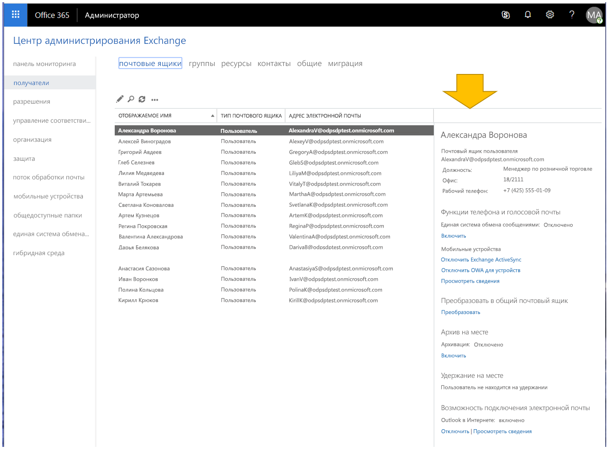

# Использование примеров пакетов данных в подписке разработчика на Office 365Use sample data packs with your Office 365 developer subscription

Вы можете установить примеры пакетов данных в подписке разработчика на Office 365.You can install sample data packs on your Office 365 developer subscription. Примеры пакетов данных позволяют экономить время, автоматически устанавливая данные и содержимое, необходимые для создания и тестирования решений.Sample data packs save you time by automatically installing data and content you need to build and test your solutions. Сюда относятся вымышленные пользователи, метаданные и фотографии для имитации небольшой корпоративной среды.This includes fictitious users, metadata, and photos to simulate a small corporate environment. Вы можете быстро установить пример данных, чтобы не тратить время на их создание, а сосредоточиться на своих решениях.You can quickly install the sample data so that you can focus on your solutions rather than spend time creating sample data yourself.

Примеры пакетов данных можно найти на [информационной панели программы для разработчиков Office 365](https://developer.microsoft.com/office/profile) в нижней части плитки подписки на Office 365.You can find sample data packs on your [Office 365 Developer Program dashboard](https://developer.microsoft.com/office/profile), at the bottom of your Office 365 subscription tile.

В настоящее время доступны следующие примеры пакетов данных.The following sample data packs are currently available:

- Пользователи. Устанавливает 16 вымышленных пользователей с лицензиями, почтовыми ящиками и метаданными, включая имена и фотографии для каждого пользователя.Users - Installs 16 fictitious users with licenses, mailboxes, and metadata, including names and photos for each user. Используйте API Microsoft Graph для работы с примерами данных пользователей следующим образом:Use Microsoft Graph APIs to work with user sample data in the following ways:
  - Получение сведений об определенном пользователеGet specific user details
  - Обновление пользователяUpdate user
  - Получение подчиненныхGet user's direct reports.
  - Подготовка организационной диаграммыPrepare organization chart  
  - Получение пользователей по отделамGet users by department

- Почта и события. Добавляет беседы электронной почты Outlook и события календаря для каждого из 16 примеров пользователей.Mail and events - Adds Outlook email conversations and calendar events for each of the 16 sample users. Используйте API Microsoft Graph для работы с примерами данных почты и событий следующим образом:Use Microsoft Graph APIs to work with mail and events sample data in the following ways:
  - Получение сообщений электронной почты для пользователейGet emails by users
  - Получение сообщений электронной почты, отфильтрованных по датеGet emails filtered by date
  - Получение предстоящих событийGet upcoming events
  - Обновление и удаление предстоящих событийUpdate/delete upcoming events

> [!NOTE]
> Перед установкой примера данных "Почта и события" требуется установить пример пакета данных "Пользователи".You must install the Users sample data pack before you install Mail and Events.

## Что добавляют примеры пакетов данных в мою подписку на Office 365?What do the sample data packs add to my Office 365 subscription?

Пример пакета данных "Пользователи" создает в вашей подписке 16 вымышленных пользователей и добавляет лицензии, а также почтовые ящики, имена, метаданные и фотографии для каждого пользователя.The Users sample data pack creates 16 fictitious users on your subscription, and includes the licenses for each user, and mailboxes, names, metadata, and photos for each.

Пример пакета данных "Почта и события" добавляет беседы электронной почты Outlook и события календаря для каждого из 16 установленных пользователей.The Mail and Events sample data pack adds Outlook email conversations and calendar events for each of the 16 users installed.

## Как установить пример пакета данных "Пользователи"?How do I install the Users sample data pack?

Перед установкой примера пакета данных "Пользователи" убедитесь в наличии подписки разработчика на Office 365 и назначьте для себя лицензию администратора.Before you install the Users sample data pack, make sure that you have an Office 365 developer subscription and that you assign a license to yourself as the admin.

Чтобы установить пример пакета данных "Пользователи":To install the Users sample data pack:

1. Выберите поле **Пользователи** внизу плитки подписки.Select the **Users** box at the bottom of your subscription tile.
2. Скопируйте идентификатор администратора. Он потребуется для входа в вашу подписку.Copy your administrator ID; you will need it to sign in to your subscription.
3. Введите идентификатор администратора и пароль на странице входа.Enter your administrator ID and password on the sign in page.
4. Дайте согласие на получение доступа в качестве администратора подписки разработчика на Office 365.Consent to the permissions as an administrator of your Office 365 developer subscription.

5. Настройте пароли для всех пользователей из примера.Configure your passwords for all sample users. Для удобства администрирования всех вымышленных пользователей потребуется задать один общий пароль.You will need to have one shared password defined for easy administration of all your fictitious users.

6. Будет выполнена установка данных,The data will be installed. занимающая около 5 минут.The installation should take about 5 minutes.

7. После завершения установки вы получите уведомление по электронной почте, а поле на плитке подписки станет зеленым.When installation is finished, you'll be notified by email, and the box on your subscription tile will be green. Теперь вы можете установить пример пакета данных "Почта и события".You can now install the Mail and Events sample data pack.

## Как установить пример пакета данных "Почта и события"?How do I install the Mail and Events sample data pack?

После установки примера пакета данных "Пользователи" можно установить пакет данных "Почта и события".After you've installed the Users sample data pack, you can install mail and events.

1. На плитке подписки выберите поле **Почта и события**.Choose the **Mail &amp; Events** box on your subscription tile.
2. Нажмите кнопку **Установить**, чтобы начать установку.Select **Install** to begin installation.

> [!NOTE]
> Если вы только что создали свою подписку, ее требуется полностью подготовить перед началом установки.If you just created your subscription, it must be fully provisioned before installation can begin. Это может занять несколько часов.This can take up to a few hours. После запуска установка может занять до 20 минут.After installation starts, it can take up to 20 minutes to finish.

3. После завершения установки вы получите уведомление по электронной почте, а поле на плитке подписки станет зеленым.When installation is finished, you'll be notified by email, and the box on your subscription tile will be green.

## Ожидаются ли дополнительные примеры пакетов данных?Are more sample data packs coming?

Да.Yes. Мы добавим примеры пакетов данных для SharePoint и OneDrive.We will add sample data packs for SharePoint and OneDrive. В дальнейшем мы предполагаем добавить примеры пакетов данных для других продуктов и технологий, включая надстройки Office, Microsoft Teams и т. д.In the future, we will consider adding sample data packs for more products and technologies, including Office Add-ins, Microsoft Teams, and more.

## Можно ли установить примеры пакетов данных в другие подписки на Office 365?Can I install sample data packs on my other Office 365 subscriptions?

Нет.No. Эти примеры пакетов данных совместимы только с подпиской разработчика на Office 365, предоставляемой в рамках программы для разработчиков Office 365.These sample data packs are only compatible with the Office 365 Developer Subscription you get as part of the Office 365 Developer Program.

## Как просмотреть примеры данных в своей подписке?How can I see the sample data in my subscription?

Чтобы просмотреть добавленных пользователей после установки примера пакета данных "Пользователи", перейдите в **Центр администрирования Microsoft 365**, используя подписку разработчика на Office 365.After you install the Users sample data pack, to see the users that were added, go to the **Microsoft 365 Admin Center** on your Office 365 developer subscription. В разделе **Пользователи** выберите пункт **Активные пользователи**.Under **Users**, select **Active users**. Вы увидите список 16 пользователей.You will see the list of 16 users. Вы можете выбрать пользователя, чтобы просмотреть связанные с ним метаданные, включая фотографии и лицензии.You can select a user to view the associated metadata, including photos and licenses.

Чтобы просмотреть пример данных после установки примера пакета данных "Почта и события", в **Центре администрирования Microsoft 365** выберите команду **Показать все**, а затем выберите пункт **Exchange**.After you install the Mail and Events sample pack, to see the sample data, in the **Microsoft 365 Admin Center**, choose **Show all** and then select **Exchange**. В Центре администрирования Exchange, выбрав пункт **получатели**, можно увидеть, что для каждого из 16 пользователей добавлены почтовые ящики с сообщениями и событиями.In the Exchange admin center, when you select **recipients**, you can see that each of the 16 users has mailboxes with mail and events added.

## См. такжеSee also

- [Настройка подписки разработчика Office 365Set up an Office 365 developer subscription](office-365-developer-program-get-started.md)
