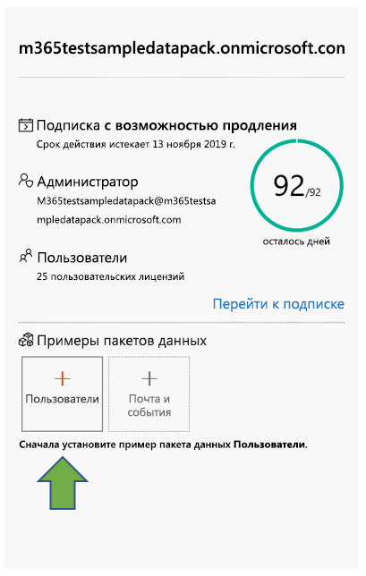
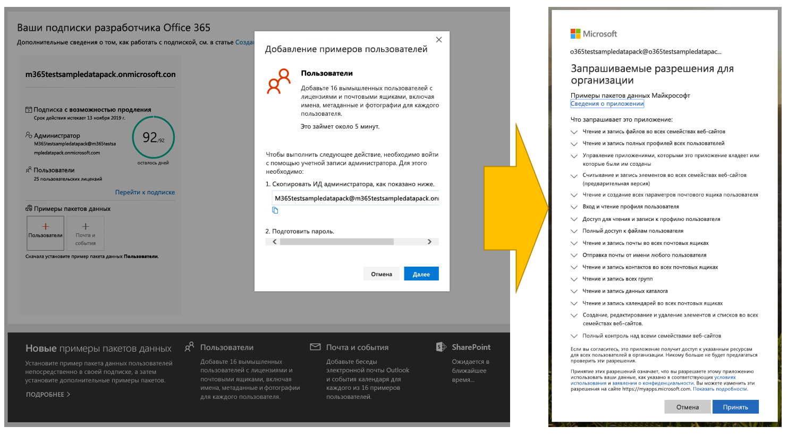
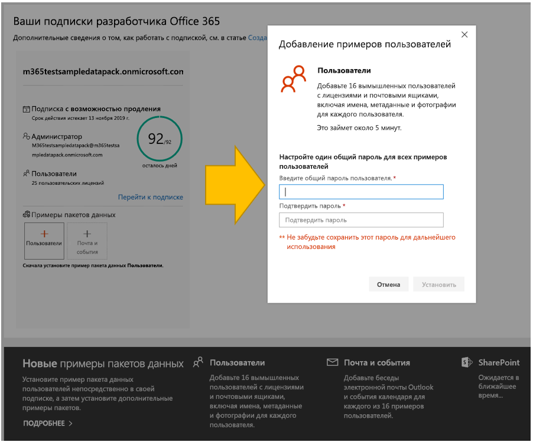
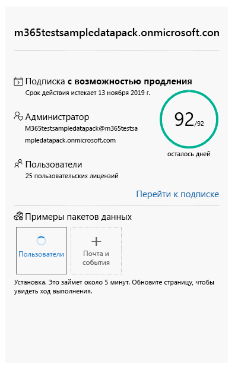
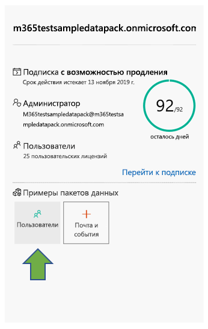
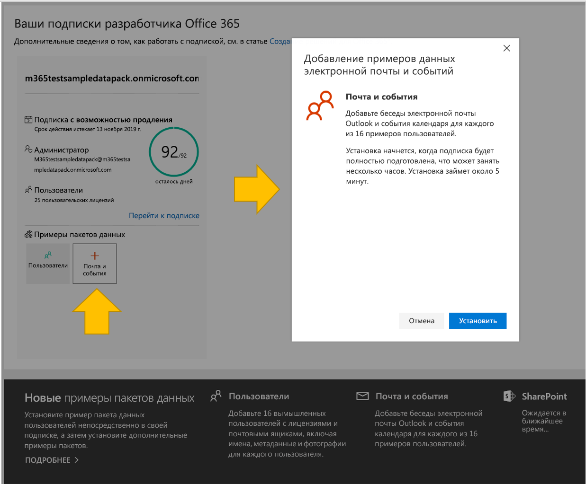

# Использование примеров пакетов данных в подписке разработчика на Office 365

Вы можете установить примеры пакетов данных в подписке разработчика на Office 365. Примеры пакетов данных позволяют экономить время, автоматически устанавливая данные и содержимое, необходимые для создания и тестирования решений. Сюда относятся вымышленные пользователи, метаданные и фотографии для имитации небольшой корпоративной среды. Вы можете быстро установить пример данных, чтобы не тратить время на их создание, а сосредоточиться на своих решениях.

Примеры пакетов данных можно найти на [информационной панели программы для разработчиков Office 365](https://developer.microsoft.com/office/profile) в нижней части плитки подписки на Office 365.

В настоящее время доступны следующие примеры пакетов данных.

- Пользователи. Устанавливает 16 вымышленных пользователей с лицензиями, почтовыми ящиками и метаданными, включая имена и фотографии для каждого пользователя. Используйте API Microsoft Graph для работы с примерами данных пользователей следующим образом:
  - Получение сведений об определенном пользователе
  - Обновление пользователя
  - Получение подчиненных
  - Подготовка организационной диаграммы  
  - Получение пользователей по отделам

- Почта и события. Добавляет беседы электронной почты Outlook и события календаря для каждого из 16 примеров пользователей. Используйте API Microsoft Graph для работы с примерами данных почты и событий следующим образом:
  - Получение сообщений электронной почты для пользователей
  - Получение сообщений электронной почты, отфильтрованных по дате
  - Получение предстоящих событий
  - Обновление и удаление предстоящих событий

> [!NOTE]
> Перед установкой примера данных "Почта и события" требуется установить пример пакета данных "Пользователи".

## Что добавляют примеры пакетов данных в мою подписку на Office 365?

Пример пакета данных "Пользователи" создает в вашей подписке 16 вымышленных пользователей и добавляет лицензии, а также почтовые ящики, имена, метаданные и фотографии для каждого пользователя.

Пример пакета данных "Почта и события" добавляет беседы электронной почты Outlook и события календаря для каждого из 16 установленных пользователей.

## Как установить пример пакета данных "Пользователи"?

Перед установкой примера пакета данных "Пользователи" убедитесь в наличии подписки разработчика на Office 365 и назначьте для себя лицензию администратора.

> [!NOTE]
> Убедитесь, что в вашей подписке доступно 16 пользователей. Ваша подписка включает 25 пользователей. Если вы уже настроили более 10 пользователей, сначала удалите некоторых из них, чтобы обеспечить успешную установку.

Чтобы установить пример пакета данных "Пользователи":

1. Выберите поле **Пользователи** внизу плитки подписки.
2. Скопируйте идентификатор администратора. Он потребуется для входа в вашу подписку.
3. Введите идентификатор администратора и пароль на странице входа.
4. Дайте согласие на получение доступа в качестве администратора подписки разработчика на Office 365.

5. Настройте пароли для всех пользователей из примера. Для удобства администрирования всех вымышленных пользователей потребуется задать один общий пароль.

6. Будет выполнена установка данных, занимающая около 5 минут.

7. После завершения установки вы получите уведомление по электронной почте, а поле на плитке подписки станет зеленым. Теперь вы можете установить пример пакета данных "Почта и события".

## Как установить пример пакета данных "Почта и события"?

После установки примера пакета данных "Пользователи" можно установить пакет данных "Почта и события".

1. На плитке подписки выберите поле **Почта и события**.
2. Нажмите кнопку **Установить**, чтобы начать установку.

> [!NOTE]
> Если вы только что создали свою подписку, ее требуется полностью подготовить перед началом установки. Это может занять несколько часов. После запуска установка может занять до 20 минут.

3. После завершения установки вы получите уведомление по электронной почте, а поле на плитке подписки станет зеленым.

## Ожидаются ли дополнительные примеры пакетов данных?

Да. Мы добавим примеры пакетов данных для SharePoint и OneDrive. В дальнейшем мы предполагаем добавить примеры пакетов данных для других продуктов и технологий, включая надстройки Office, Microsoft Teams и т. д.

## Можно ли установить примеры пакетов данных в другие подписки на Office 365?

Нет. Эти примеры пакетов данных совместимы только с подпиской разработчика на Office 365, предоставляемой в рамках программы для разработчиков Office 365.

## Как просмотреть примеры данных в своей подписке?

Чтобы просмотреть добавленных пользователей после установки примера пакета данных "Пользователи", перейдите в **Центр администрирования Microsoft 365**, используя подписку разработчика на Office 365. В разделе **Пользователи** выберите пункт **Активные пользователи**. Вы увидите список 16 пользователей. Вы можете выбрать пользователя, чтобы просмотреть связанные с ним метаданные, включая фотографии и лицензии.

Чтобы просмотреть пример данных после установки примера пакета данных "Почта и события", в **Центре администрирования Microsoft 365** выберите команду **Показать все**, а затем выберите пункт **Exchange**. В Центре администрирования Exchange, выбрав пункт **получатели**, можно увидеть, что для каждого из 16 пользователей добавлены почтовые ящики с сообщениями и событиями.

## См. также

- [Настройка подписки разработчика Office 365](office-365-developer-program-get-started.md)
