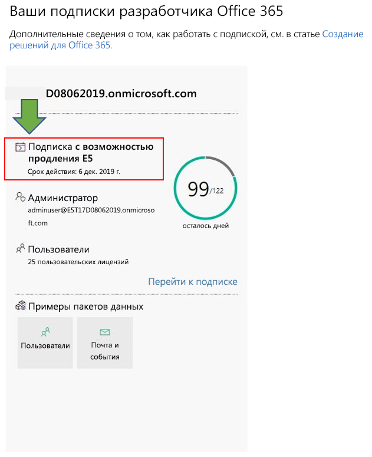
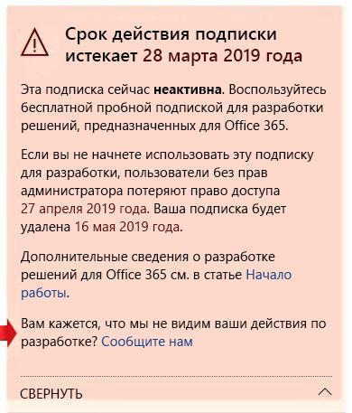

# Вопросы и ответы о программе для разработчиков Office 365Office 365 Developer Program FAQ

Ниже представлены вопросы и ответы о программе для разработчиков Office 365.The following are frequently asked questions about the Office 365 Developer Program.

## Что такое программа для разработчиков Office 365 и кому следует к ней присоединиться?What is the Office 365 Developer Program and who should join it?

Программа для разработчиков Office 365 помогает создавать ориентированные на пользователей, кроссплатформенные эффективные интерфейсы, расширяющие возможности Office 365.The Office 365 Developer Program is designed to help you build people-centric, cross-platform productivity experiences that extend Office 365. Присоединяйтесь к программе для получения доступа к инструментам, документации, учебным материалам, экспертам и событиям сообщества, необходимым для создания отличных решений для продуктов и технологий Office 365, включая:Join our program to get access to the tools, documentation, training, experts, and community events that you need to build great solutions for Office 365 products and technologies, including:

- Веб-надстройки [Excel](https://developer.microsoft.com/excel), [Outlook](https://developer.microsoft.com/outlook), [Word](https://developer.microsoft.com/word) и [PowerPoint](https://developer.microsoft.com/powerpoint)[Excel](https://developer.microsoft.com/excel), [Outlook](https://developer.microsoft.com/outlook), [Word](https://developer.microsoft.com/word), and [PowerPoint](https://developer.microsoft.com/powerpoint) web add-ins
- [SharePointSharePoint](https://developer.microsoft.com/sharepoint)
- [Microsoft TeamsMicrosoft Teams](https://developer.microsoft.com/microsoft-teams)
- [Microsoft GraphMicrosoft Graph](https://developer.microsoft.com/graph)

Являясь участником программы, вы получаете бесплатную подписку разработчика Office 365 с 25 пользовательскими лицензиями, предназначенными для создания решений.As a program member, you can get a free Office 365 developer subscription with 25 user licenses to use to build your solutions. Эта подписка остается активной, пока вы активно разрабатываете и развертываете решения.This subscription will remain active for as long as you’re actively developing and deploying solutions.

Дополнительные сведения см. в статьях [Присоединяйтесь к программе для разработчиков Office 365](office-365-developer-program.md) и [Создание решений для Office 365](build-office-365-solutions.md).For more information, see [Join the Office 365 Developer Program](office-365-developer-program.md) and [Build Office 365 solutions](build-office-365-solutions.md).

## Какую учетную запись можно использовать для регистрации в программе для разработчиков Office 365?What account can I use to sign up for the Office 365 Developer Program?

Вы можете зарегистрироваться в программе для разработчиков с помощью одного из следующих типов учетных записей:You can sign up for the developer program by using one of the following account types:

- **Учетная запись Майкрософт** (созданная для личного использования). Обеспечивает доступ ко всем потребительским продуктам и облачным службам Майкрософт, таким как Outlook (Hotmail), Messenger, OneDrive, MSN, Xbox Live или Office 365.**Microsoft account** (created by you for personal use) - Provides access to all consumer-oriented Microsoft products and cloud services, such as Outlook (Hotmail), Messenger, OneDrive, MSN, Xbox Live, or Office 365. При регистрации почтового ящика Outlook.com автоматически создается учетная запись Майкрософт.Signing up for an Outlook.com mailbox automatically creates a Microsoft account. После создания учетной записи Майкрософт ее можно использовать для доступа к потребительским облачным службам Майкрософт или Azure.After a Microsoft account is created, it can be used to access consumer-related Microsoft cloud services or Azure. 
- **Рабочая учетная запись** (предоставленная администратором для рабочих целей). Обеспечивает доступ ко всем облачным службам Майкрософт для малого, среднего и корпоративного бизнеса, таким как Azure, Microsoft Intune или Office 365.**Work account** (issued by an admin for business use) - Provides access to all small, medium, and enterprise business-level Microsoft cloud services, such as Azure, Microsoft Intune, or Office 365. Когда вы регистрируетесь в качестве организации в одной из этих служб, в Azure Active Directory автоматически подготавливается облачный каталог для представления вашей организации.When you sign up to one of these services as an organization, a cloud-based directory is automatically provisioned in Azure Active Directory to represent your organization. Дополнительные сведения см. в статье [Управление каталогом Azure AD](https://docs.microsoft.com/azure/active-directory/active-directory-administer).For more information, see [Manage your Azure AD directory](https://docs.microsoft.com/azure/active-directory/active-directory-administer).
- **Идентификатор Visual Studio** (созданный для подписок на Visual Studio Professional или Enterprise). Рекомендуется использовать этот вариант для присоединения к программе разработчиков из галереи Visual Studio, чтобы получить все преимущества как подписчик на Visual Studio.**Visual Studio ID** (created for your Visual Studio Professional or Enterprise subscriptions) - We recommend that you use this option to join the developer program from within the Visual Studio Gallery to get the full benefits as a Visual Studio subscriber. 

## Как получить подписку разработчика Office 365 в рамках программы для разработчиков?How can I get an Office 365 developer subscription via the Developer Program?  

Когда вы присоединитесь к программе для разработчиков Office 365, вы получите право на бесплатную подписку разработчика Office 365.If you join the Office 365 Developer Program, you qualify to get a free Office 365 developer subscription. Эта специальная подписка предназначена только для разработки приложений.This is a special subscription designed to be used for application development only, and comes with 25 user licenses. Дополнительные сведения см. в статье [Настройка подписки разработчика Office 365](office-365-developer-program-get-started.md).For more information, see [Set up an Office 365 developer subscription](office-365-developer-program-get-started.md).

## Какой идентификатор используется для входа в панель мониторинга программы для разработчиков?What ID do I use to sign in to the Developer Program dashboard?

Чтобы получить доступ к сведениям о своей подписке, используйте идентификатор участника для входа в панель мониторинга программы для разработчиков.Use your member ID to sign in to the Developer Program dashboard to access information about your subscription. Это учетная запись Майкрософт или электронная почта с поддержкой Azure Active Directory, использованная для входа при присоединении к программе.This is the Microsoft account or Azure Active Directory-enabled email that you used to sign in when you joined the program.

## Какой идентификатор используется для входа в подписку разработчика?What ID do I use to sign in to my developer subscription?

Используйте идентификатор администратора, созданный при настройке подписки разработчика.Use the administrator ID that you created when you set up your developer subscription. Идентификатор администратора можно найти на плитке подписки в [панели мониторинга программы для разработчиков](https://developer.microsoft.com/ru-RU/office/profile).You can find your administrator ID on the subscription tile on the [Developer Program dashboard](https://developer.microsoft.com/ru-RU/office/profile).

## Что включено в подписку разработчика?What's included in the Office 365 developer subscription?

Если вы создали подписку после 25 августа 2019 г., вы используете подписку разработчика Microsoft 365 E5 с 25 пользовательскими лицензиями.If you created your subscription after August 25, 2019, you have a Microsoft 365 E5 Developer subscription with 25 user licenses. Пользователи, присоединившиеся к программе до 25 августа 2019 г., используют подписку разработчика Office 365 E3 с 25 пользовательскими лицензиями.Customers who joined the program before August 25, 2019, have an Office 365 E3 Developer subscription with 25 user licenses.

Подписка разработчика Office 365 E3 включает следующее:The Office 365 E3 Developer subscription includes the following:

- [Exchange Online (план 2)Exchange Online (Plan 2)](https://products.office.com/exchange/compare-microsoft-exchange-online-plans)
- [Flow для Office 365Flow for Office 365 Plan 2](https://flow.microsoft.com/pricing/)
- [Защита данных для Office 365 — Standard](https://products.office.com/ru-RU/business/azure-information-protection-for-office-365)Information Protection for Office 365
- [Microsoft Forms (план E5)Microsoft Forms (Plan E5)](https://support.office.com/article/Frequently-asked-questions-about-Microsoft-Forms-495c4242-6102-40a0-add8-df05ed6af61c)
- [Планировщик (Майкрософт)Microsoft Planner](https://products.office.com/compare-all-microsoft-office-products?tab=2)
- [Поиск (Майкрософт)Microsoft Search](https://products.office.com/en-us/business/intelligent-search?tab=Discovery)
- [Microsoft Stream для SKU Office 365 E5Microsoft Stream for O365 E5 SKU](https://products.office.com/business/office-365-enterprise-e5-business-software)
- [Microsoft TeamsMicrosoft Teams](https://products.office.com/business/office-365-enterprise-e5-business-software)
- [Управление мобильными устройствами для Office 365Mobile Device Management for Office 365](https://support.office.com/article/Set-up-Mobile-Device-Management-MDM-in-Office-365-dd892318-bc44-4eb1-af00-9db5430be3cd)
- [Office 365 профессиональный плюсOffice 365 ProPlus](https://products.office.com/business/office-365-proplus-business-software)
- [Office в ИнтернетеOffice for the web](https://docs.microsoft.com/ru-RU/office365/servicedescriptions/office-online-service-description/office-online-service-description)
- [PowerApps для Office 365PowerApps for Office 365 Plan 2](https://powerapps.microsoft.com/pricing/)
- [SharePoint Online для разработчиковSharePoint Online for Developer](https://products.office.com/SharePoint/compare-sharepoint-plans)
- [Skype для бизнеса Online (план 2)Skype for Business Online (Plan 2)](https://products.office.com/skype-for-business/online-meeting-solutions)
- [SwaySway](https://sway.com/)
- [To-Do (план 3)To-Do (Plan 3)](https://todo.microsoft.com)
- [Доска (план 2)Whiteboard (Plan 2)](https://products.office.com/ru-RU/microsoft-whiteboard/digital-whiteboard-app)

Подписка разработчика Microsoft 365 E5 содержит все приложения, входящие в подписку разработчика Office 365 E3, а также следующие новые функции:The Microsoft 365 E5 Developer subscription includes all the apps that are included in the Office 365 E3 Developer subscription, plus the following new features:  

- Расширенные функции аналитики на базе Power BIAdvanced analytics with Power BI  
- Enterprise Mobility + Security (EMS) для обеспечения соответствия требованиям и защиты информацииEnterprise Mobility + Security (EMS) for compliance and information protection  
- Office 365 Advanced Threat ProtectionOffice 365 Advanced Threat Protection 
- Azure Active Directory для создания улучшенных решений для управления удостоверениями и доступомAzure Active Directory for building advanced identity and access management solutions  

Подписка разработчика Microsoft 365 E5 включает следующее:The Microsoft 365 E5 Developer subscription includes the following: 

- Azure Active Directory Premium P1Azure Active Directory Premium 
- Azure Active Directory Premium P2Azure Active Directory Premium 
-   Расширенная защита от угроз AzureAzure Advanced Threat Protection 
-   Azure Information Protection Premium P1Azure Information Protection Premium P1 
-   Azure Information Protection Premium P2Azure Information Protection Premium P2 
-   Защищенное хранилище пользователяCustomer Lockbox 
-   Exchange Online (план 2)Exchange Online (Plan 2) 
-   Flow для Office 365Flow for Office 365 Plan 2 
-   Защита данных для Office 365 — PremiumInformation Protection for Office 365 
-   Защита данных для Office 365 — StandardInformation Protection for Office 365 
-   Microsoft Azure Active Directory RightsMicrosoft Azure Active Directory 
-   Многофакторная идентификация Microsoft AzureMicrosoft Azure Active Directory Multi-Factor Authentication 
-   Microsoft Cloud App SecurityMicrosoft Cloud App Security 
-   Microsoft Forms (план E5)Microsoft Forms (Plan E5) 
-   Microsoft IntuneMicrosoft Intune 
-   Microsoft MyAnalytics (полнофункциональная версия)Microsoft MyAnalytics (Full) 
-   Планировщик (Майкрософт)Microsoft Planner 
-   Microsoft StaffHubMicrosoft StaffHub 
-   Microsoft Stream для SKU Office 365 E5Microsoft Stream for O365 E5 SKU 
-   Microsoft TeamsMicrosoft Teams 
-   Управление мобильными устройствами для Office 365Mobile Device Management for Office 365 
-   Office 365 Advanced eDiscoveryOffice 365 Advanced eDiscovery 
-   Расширенное управление безопасностью Office 365Office 365 Advanced Security Management 
-   Расширенная защита от угроз Office 365 (план 1)Office 365 Advanced Threat Protection 
-   Расширенная защита от угроз Office 365 (план 2)Office 365 Advanced Threat Protection 
-   Office 365 Privileged Access ManagementOffice 365 Privileged Access Management 
-   Office 365 профессиональный плюсOffice 365 ProPlus 
-   Office OnlineOffice Online 
-   Телефонная системаPhone System 
-   Power BI ProPower BI Pro 
-   PowerApps для Office 365 (план 3)PowerApps for Office 365 Plan 2 
-   SharePoint Online (план 2)SharePoint Online Plan 2 
-   Skype для бизнеса Online (план 2)Skype for Business Online (Plan 2) 
-   SwaySway 
-   To-Do (план 3)To-Do (Plan 3) 
-   Доска (план 3)Whiteboard (Plan 3) 
-   Yammer корпоративныйYammer Enterprise 

Узнать свою подписку (Microsoft 365 E5 или Office 365 E3) можно с помощью плитки подписки в [панели мониторинга](https://developer.microsoft.com/office/profile).You can determine whether you have a Microsoft 365 E5 subscription or an Office 365 E3 subscription on the subscription tile on your [dashboard](https://developer.microsoft.com/office/profile). На плитке указывается E3 или E5 под именем домена подписки.The tile will show either E3 or E5 under the subscription domain name.

.

## Включает ли эта подписка также подписку на Azure?Does the subscription also include a subscription to Azure?

Это предложение не включает подписку на Azure.This offer does not include a subscription to Azure. Тем не менее, чтобы получить бесплатный доступ к службам Azure, вы можете [создать бесплатную учетную запись Azure](https://azure.microsoft.com/free/).However, to receive free access to Azure services, you can [create a free Azure account](https://azure.microsoft.com/free/). 

## Сколько пользовательских лицензий включает подписка разработчика Office 365?How many user licenses does the Office 365 developer subscription include?

Подписка разработчика Office 365 включает 25 пользовательских лицензий, в том числе администратора, только для целей разработки.Your Office 365 developer subscription includes 25 user licenses, including the administrator, for development purposes only. Использование этой подписки для любых целей, отличных от разработки приложений, является нарушением лицензионного соглашения.Using this subscription for any purpose other than application development is a violation of the license agreement. Дополнительные сведения об ограничениях лицензирования см. в статье [Условия использования подписки разработчика Office 365](terms-and-conditions.md).For more details about the licensing restrictions, see the [Office 365 developer subscription terms of use](terms-and-conditions.md).

## Как долго действует моя подписка и когда истекает ее срок?How long is my subscription good for, and when does it expire?

Подписка действует в течение 90 дней и продлевается на основе осуществления допустимых действий разработки.Your subscription is good for 90 days and is renewable based on valid developer activity. Если вы используете подписку для разработки, она продлевается каждые 3 месяца и действует в течение неограниченного времени.If you're using your subscription for development, it will be renewed every 3 months and will last indefinitely. Вы можете найти дату окончания и название подписки [в панели мониторинга программы для разработчиков Office 365](https://developer.microsoft.com/ru-RU/office/profile).You can find the expiration date, along with your subscription name, on your [Office 365 Developer Program dashboard](https://developer.microsoft.com/ru-RU/office/profile). Дополнительные сведения см. в статье [Окончание и продление срока действия подписки](subscription-expiration-and-renewal.md).For more information, see [Subscription expiration and renewal](subscription-expiration-and-renewal.md).

Если вы присоединяетесь к программе с помощью Visual Studio Enterprise или Visual Studio Professional, ваша подписка будет автоматически продлеваться до окончания срока действия подписки на Visual Studio.If you're joining the program through Visual Studio Enterprise or Visual Studio Professional, your subscription is automatically renewed until your Visual Studio subscription expires. 

## Почему не предлагается годовая подписка?Why don’t you offer a one-year subscription?

В апреле 2019 г. мы перешли на новую модель, в которой подписку можно постоянно продлевать каждые 90 дней, если вы активно используете ее для разработки.In April 2019, we transitioned to a new model where your subscription can be renewed perpetually every 90 days if you're actively using it for development. Мы считаем, что эта модель обеспечивает наличие подписки для разработчиков, активно разрабатывающих решения, пока она требуется.We believe that this model ensures that developers who are actively developing solutions have a subscription for as long as they need one. Если вы часто выполняете разработку, срок действия вашей подписки никогда истечет; он автоматически продлевается.If you're developing frequently, your subscription never expires; it is automatically extended. Если вы выполняете разработку в течение короткого периода времени и ваша подписка закончилась и была удалена, можно оформить новую.If you're developing for a short time, and your subscription expires and is deleted, you can sign up for a new one. 

Если вы предпочитаете иметь подписку с более длительным сроком действия, рекомендуется получить подписку на Visual Studio Professional или Visual Studio Enterprise.If you prefer to have a subscription that is available for a longer time, we recommend that you get the Visual Studio Professional or Visual Studio Enterprise subscription. Эти программы включают бесплатную подписку разработчика Office 365, действующую в течение срока подписки на Visual Studio.These programs include a free Office 365 developer subscription that is good for the life of your Visual Studio subscription. Чтобы получить ее, перейдите на страницу [Visual Studio | My Benefits](https://my.visualstudio.com/benefits).To access this, go to [Visual Studio | My Benefits](https://my.visualstudio.com/benefits). За дополнительными сведениями обратитесь в [Центр обслуживания клиентов Visual Studio](https://www.visualstudio.com/subscriptions/support/).For more information, contact [Visual Studio customer service](https://www.visualstudio.com/subscriptions/support/). 

## Как определяется, можно ли продлевать подписку?How do you determine whether a subscription can be renewed?

Мы используем набор алгоритмов и данные телеметрии, получаемые о ваших действиях в программе для разработчиков Office 365, а также в подписке разработчика Office 365, чтобы определить, осуществляете ли вы активную разработку.We use a set of algorithms and telemetry that we get from your activity in the Office 365 Developer Program and on your Office 365 developer subscription to determine whether you are actively developing. Это проверка выполняется регулярно, чтобы обновлять ваше состояние и определять, следует ли продлевать подписку.We check these regularly to update your status and determine whether your subscription should be extended. 

Если вы считаете, что мы неправильно учли ваши действия по разработке, можете сообщить нам через панель мониторинга.If you think we somehow missed tracking your development activity accurately, you can let us know via your dashboard. Чтобы отправить форму, сообщающую о том, как вы используете свою подписку для разработки, в предупреждении панели мониторинга щелкните ссылку **Сообщите нам**, как показано на рисунке ниже.To submit a form that tells us how you are using your subscription for development, in the dashboard warning, choose the **Let us know** link, as shown in the following image. Мы рассмотрим ваш запрос и сообщим, имеете ли вы право на продление.We will review your request and let you know if you qualify for an extension. 

 

## Как определяются действия по разработке?How do you define development activity?

Ваши действия в программе для разработчиков Office 365 и подписке разработчика Office 365 определяют, осуществляете ли вы активную разработку и следует ли продлить вашу подписку.Your activity in the Office 365 Developer Program and on your Office 365 developer subscription determine whether you are actively developing and whether your subscription should be extended. 

Дополнительные сведения о типах отслеживаемых действий см. в статье [Условия использования подписки разработчика Office 365](terms-and-conditions.md).For more information about the types of activities that we track, see the [Office 365 developer subscription terms of use](terms-and-conditions.md). 

## Когда срок действия моей подписки будет истекать, смогу ли я его продлить?When my subscription is about to expire, can I extend it?

Единственный способ продления подписки состоит в осуществлении допустимых действий разработки.The only way that you can extend your subscription is to do valid developer activity. Если вы используете подписку для разработки пользовательских решений, срок ее действия закончится и в конечном итоге он будет удалена.If you're using your subscription to develop custom solutions, your subscription will expire and will eventually be deleted. 

Дополнительные сведения см. в статье [Окончание и продление срока действия подписки](subscription-expiration-and-renewal.md).For more information, see [Subscription expiration and renewal](subscription-expiration-and-renewal.md).

## Если срок действия моей подписки завершается, сколько у меня есть времени до ее удаления?If my subscription is going to expire, how much time do I have before it is deleted?

Для переноса данных есть 30 дней после истечения срока действия подписки.You have 30 days after your subscription expires to migrate any data. В следующие 30 дней только администратор будет иметь доступ к подписке, а на 60 день подписка и все данные будут удалены.For the next 30 days, only the admin will have access to the subscription, and on day 60, the subscription and all data will be deleted.

## Как перейти с подписки Office 365 E3 на подписку Microsoft 365 E5?How can I migrate from an Office 365 E3 subscription to a Microsoft 365 E5 subscription?

В настоящее время только новые участники программы для разработчиков Office 365 автоматически получают подписку разработчика Microsoft 365 E5.Currently, only new Office 365 Developer Program members will get a Microsoft 365 E5 Developer subscription automatically. Существующим пользователям способ перехода на подписку Microsoft 365 E5 будет преложен в будущем.Existing users will be offered a way to migrate to a Microsoft 365 E5 subscription in the future. Мы работаем над тем, чтобы переход на Microsoft 365 E5 был доступен всем участникам программы для разработчиков Office 365.Rest assured, we are working to enable all Office 365 Developer Program members to migrate to Microsoft 365 E5. 

## Можно ли выбирать между подписками Office 365 E3 и Microsoft 365 E5?Can I choose whether to have an Office 365 E3 or a Microsoft 365 E5 subscription?

В настоящий момент подписка Microsoft 365 E5 предлагается только новым участникам программы для разработчиков.Currently, only new Developer Program members are offered a Microsoft 365 E5 subscription. У существующих участников с подпиской Office 365 E3 будет возможность сохранить свою текущую подписку и продлевать ее, если им не требуются новые возможности, предлагаемые в Microsoft 365 E5.Existing members with an Office 365 E3 subscription will have the option to keep their current subscription and continue to renew it if they don't need the new capibilities offered in Microsoft 365 E5. Участники программы для разработчиков могут иметь только одну подписку.Developer program members can only have one subscription.  

Когда появится возможность перехода для существующих участников программы, мы предоставим дополнительные сведения о способе перехода.When we have a migration option for existing Developer Program members, we’ll provide more information about how to migrate. 

## Являясь партнером корпорации Майкрософт, могу ли я получить подписку?As a Microsoft Partner, can I receive a subscription? 

Да, следуйте [этим инструкциям](office-365-developer-program.md), чтобы присоединиться к программе для разработчиков Office 365 и настроить подписку разработчика Office 365.Yes, you can follow [these instructions](office-365-developer-program.md) to join the Office 365 Developer Program and set up an Office 365 developer subscription. Но если у вас уже есть подписка на Visual Studio Enterprise или Visual Studio Professional (MSDN), вы можете получить подписку разработчика Office 365 в качестве преимущества.However, if you already have a Visual Studio Enterprise or Visual Studio Professional (MSDN) subscription, you can get an Office 365 developer subscription as a benefit. Чтобы получить ее, перейдите на страницу [Visual Studio | My Benefits](https://my.visualstudio.com/benefits).To access this, go to [Visual Studio | My Benefits](https://my.visualstudio.com/benefits). За дополнительными сведениями обратитесь в [Центр обслуживания клиентов Visual Studio](https://www.visualstudio.com/subscriptions/support/).For more information, contact [Visual Studio customer service](https://www.visualstudio.com/subscriptions/support/). 

## Являясь штатным сотрудником корпорации Майкрософт, могу ли я получить подписку?As a full-time Microsoft employee, can I receive a subscription?

Сотрудники корпорации Майкрософт не могут регистрироваться в рамках этого предложения.Microsoft employees cannot sign up for this offer. Однако всем штатным сотрудникам корпорации Майкрософт доступна бесплатная подписка на Visual Studio (MSDN), которая включает доступ к подписке на Office E3 для разработчиков.However, all Microsoft full-time employees have access to a free Visual Studio (MSDN) subscription that includes access to Office E3 Developer. Вы можете воспользоваться этим преимуществом на странице [Visual Studio | My Benefits](https://my.visualstudio.com/benefits).You can access this benefit at [Visual Studio | My Benefits](https://my.visualstudio.com/benefits).

## Являясь поставщиком, работающим на корпорацию Майкрософт, имею ли я право на подписку?As a vendor working at Microsoft, do I qualify for a subscription?

Да, следуйте [этим инструкциям](office-365-developer-program.md), чтобы присоединиться к программе для разработчиков Office 365 и настроить подписку разработчика Office 365.Yes, you can follow [these instructions](office-365-developer-program.md) to join the Office 365 Developer Program and set up an Office 365 developer subscription. Но даже для поставщиков эта подписка предназначена _только для применения в целях разработки приложений_.But even for vendors, this subscription is designed to be used _for application development only_. Если вы не осуществляете допустимые действия по разработке, ваша подписка не будет продлена.If you are not doing valid development activity, your subscription will not be renewed.

## Доступна ли программа для разработчиков Office 365 на моем языке?Is the Office 365 Developer Program available in my language?

Кроме английского, программа для разработчиков Office 365 доступна на следующих языках: китайский (упрощенное письмо), французский, немецкий, японский, португальский (Бразилия), русский и испанский.In addition to English, the Office 365 Developer Program is available in the following languages: Chinese (Simplified), French, German, Japanese, Portuguese (Brazil), Russian, and Spanish.

## Доступна ли подписка разработчика Office 365 на моем языке?Is the Office 365 developer subscription available in my language?

Подписка разработчика Office 365 предлагается только на английском языке.The Office 365 developer subscription is only offered in English.

## ПоддержкаSupport

Если у вас возникли проблемы при настройке подписки, ознакомьтесь со следующими ресурсами поддержки:If you have issues setting up your subscription, see the following support resources:

- [Stack OverflowStack Overflow](https://stackoverflow.com/questions)   
- [Центр обслуживания клиентов Visual StudioVisual Studio customer service](https://www.visualstudio.com/subscriptions/support/)

## См. такжеSee also

- [Присоединяйтесь к программе для разработчиков Office 365Join the Office 365 Developer Program](office-365-developer-program.md)
- [Настройка подписки разработчика Office 365Set up an Office 365 developer subscription](office-365-developer-program-get-started.md)
- [Создание решений для Office 365 с помощью подпискиUse your subscription to build Office 365 solutions](build-office-365-solutions.md)
- [Продление подписки с истекающим сроком действияRenew an expiring subscription](subscription-expiration-and-renewal.md)

 

 

 

 

 

 
