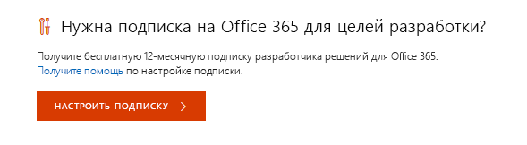
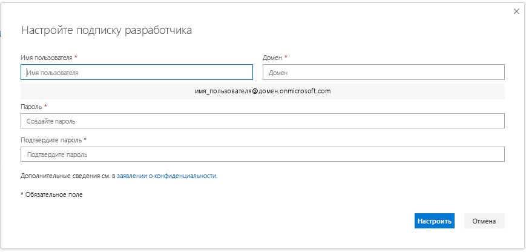
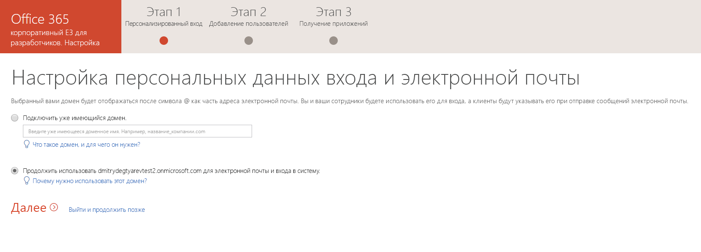
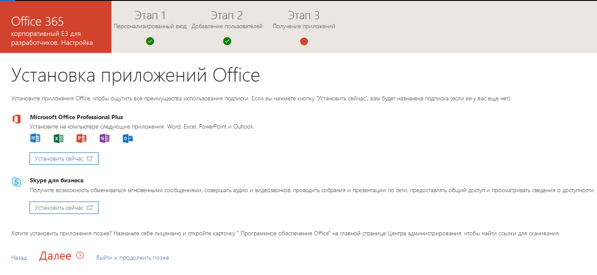

# Настройка подписки разработчика Office 365 

Настройте подписку разработчика Office 365 для создания решений независимо от рабочей среды. Это подписка на Office 365 корпоративный E3 для разработчиков с 25 пользовательскими лицензиями. Она действует в течение 90 дней и бесплатна для использования в целях разработки (решения для написания кода).

> [!NOTE] 
> Чтобы настроить подписку, необходимо сначала [присоединиться к программе для разработчиков Office 365](office-365-developer-program.md). После присоединения вы увидите вариант для настройки подписки.

## Настройка подписки

1. Чтобы получить подписку разработчика Office 365, на странице своего профиля в разделе **Нужна подписка на Office 365 для целей разработки?** нажмите кнопку **Настроить подписку**.

  

2. В диалоговом окне **Настройте подписку разработчика** создайте имя пользователя и домен. Эта учетная запись будет обладать разрешениями глобального администратора для подписки. Вы можете выбрать любое имя пользователя или домена, если оно еще не используется. Не используйте пробелы.

  

3. Создайте и подтвердите пароль.

4. Нажмите кнопку **Настроить**.

5. Если вам будет предложено подтвердить, что вы не робот, следуйте инструкциям и нажмите кнопку **Подтвердить**.

6. После создания подписки ее имя и срок действия отобразятся на странице профиля.

  > [!IMPORTANT]
  > Запишите имя пользователя и пароль, поскольку они потребуются для доступа к подписке разработчика.

## Настройка подписки

1. На странице профиля перейдите по ссылке [office.com](https://www.office.com/) и выполните вход с помощью своего идентификатора пользователя (например, username@domain.onmicrosoft.com) и пароля, указанных для подписки разработчика.

   > [!NOTE] 
   > Не входите в подписку с использованием учетных данных программы для разработчиков.

2. Используйте средство запуска приложений, чтобы перейти в [Центр администрирования](https://portal.office.com/adminportal/home#/homepage).

3. На домашней странице Центра администрирования нажмите кнопку **Установка**. В результате вы перейдете к странице **установки Office 365 корпоративный E3 для разработчиков**.

4. **Настройте персональные данные входа и электронной почты**. Вы можете подключить свою подписку к домену или использовать существующий поддомен, который вы создали. После завершения выберите пункт **Далее**.

  

5. **Добавьте новых пользователей**. Вы можете добавлять пользователей. Это могут быть вымышленные пользователи или настоящие пользователи, помогающие с разработкой. После завершения выберите пункт **Далее**.
    
  > [!NOTE]
  > Если необходимо массовое добавление пользователей, это можно сделать позднее. Дополнительные сведения см. в статье [Добавление пользователей по одному или массово в Office 365 — справка для администраторов](https://support.office.com/article/add-users-individually-or-in-bulk-to-office-365-admin-help-1970f7d6-03b5-442f-b385-5880b9c256ec).

6. **Назначьте лицензии нелицензированным пользователям**. Предоставьте лицензии всем пользователям, которым нужна возможность работы с этой подпиской. После завершения выберите пункт **Далее**.

7. **Отправьте учетные данные для входа**. Всем настоящим пользователям с доступом к подписке нужно отправить их учетные данные для входа. Можно выбрать способ отправки, например электронную почту, скачивание или печать. После завершения выберите пункт **Далее**.

8. **Установите приложения Office**. Вы можете установить приложения Office на свой компьютер. После завершения выберите пункт **Далее**.

  

   > [!TIP] 
   > При последующих посещениях панели мониторинга выполните вход с помощью своей учетной записи *username@domain*.onmicrosoft.com прежде чем перейти к панели мониторинга.

9. **Вы достигли завершения настройки**. Вы завершили настройку своей подписки. Вы можете оценить процесс при желании. После завершения **перейдите в Центр администрирования**.
    
   > [!NOTE] 
   > В настоящее время регионом по умолчанию для подписки является Северная Америка, независимо от страны или региона, в котором вы находитесь. Вы можете продолжать настройку и использование подписки разработчика.

## Подготовка служб Office 365

Внутренним службам, таким как SharePoint и Exchange, может потребоваться некоторое время для подготовки к подписке. На этом этапе некоторые значки в средстве запуска приложений и на домашней странице отображаются как **Настройка (это приложение по-прежнему настраивается)**. Это займет не более часа.

После завершения подготовки новую подписку на Office 365 можно использовать для разработки. Срок действия подписки истекает через 90 дней. Чтобы продлить его, см. раздел [Когда срок действия моей подписки будет истекать, смогу ли я его продлить?](office-365-developer-program-faq.md#renew-subscription)

Также рекомендуется включить варианты получения выпусков, чтобы обеспечить скорейший доступ к новейшим возможностям Office 365. Дополнительные сведения см. в статье [Настройка вариантов стандартного или целевого получения выпусков в Office 365](https://support.office.com/article/set-up-the-standard-or-targeted-release-options-in-office-365-3b3adfa4-1777-4ff0-b606-fb8732101f47).

## Настройка учетной записи Microsoft Azure

Для некоторых решений Office может потребоваться учетная запись Microsoft Azure, чтобы обеспечивать создание с помощью служб Azure. Чтобы настроить бесплатную учетную запись Azure, см. раздел [Создайте бесплатную учетную запись Azure уже сегодня](https://azure.microsoft.com/free/).

## Покинуть программу для разработчиков Office 365

Если вы решили, что больше не хотите участвовать в программе для разработчиков Office 365, вы можете завершить действие подписки и покинуть программу.

  > [!WARNING]
  > Указанные ниже действия удалят все сведения профиля. Вы потеряете все данные, хранящиеся в вашей подписке разработчика, которые не имеют резервной копии в другом месте.

1. Войдите в программу для разработчиков Office 365.

2. Выберите пункт **Удалить профиль**.

3. В окне подтверждения **удаления профиля** нажмите кнопку **Удалить**.

## См. также

- [Присоединяйтесь к программе для разработчиков Office 365](office-365-developer-program.md)
- [Создание решений для Office 365 с помощью подписки](build-office-365-solutions.md)
- [Продление подписки с истекающим сроком действия](subscription-expiration-and-renewal.md)
- [Вопросы и ответы о программе для разработчиков Office 365](office-365-developer-program-faq.md)
