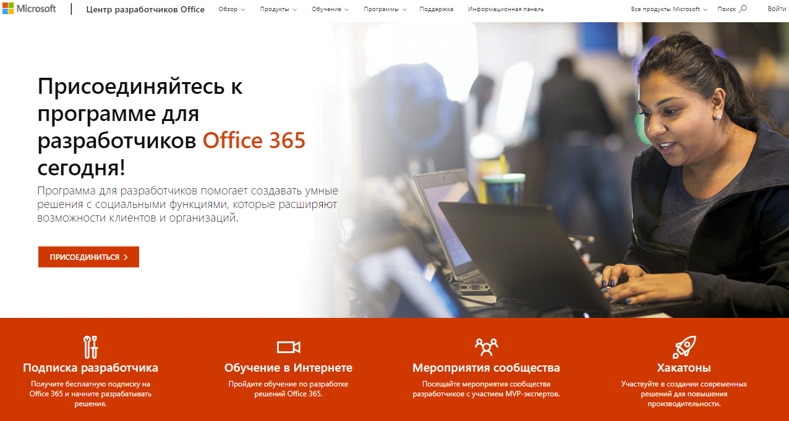
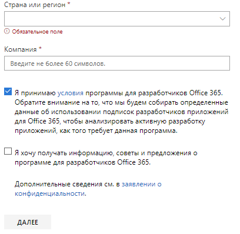
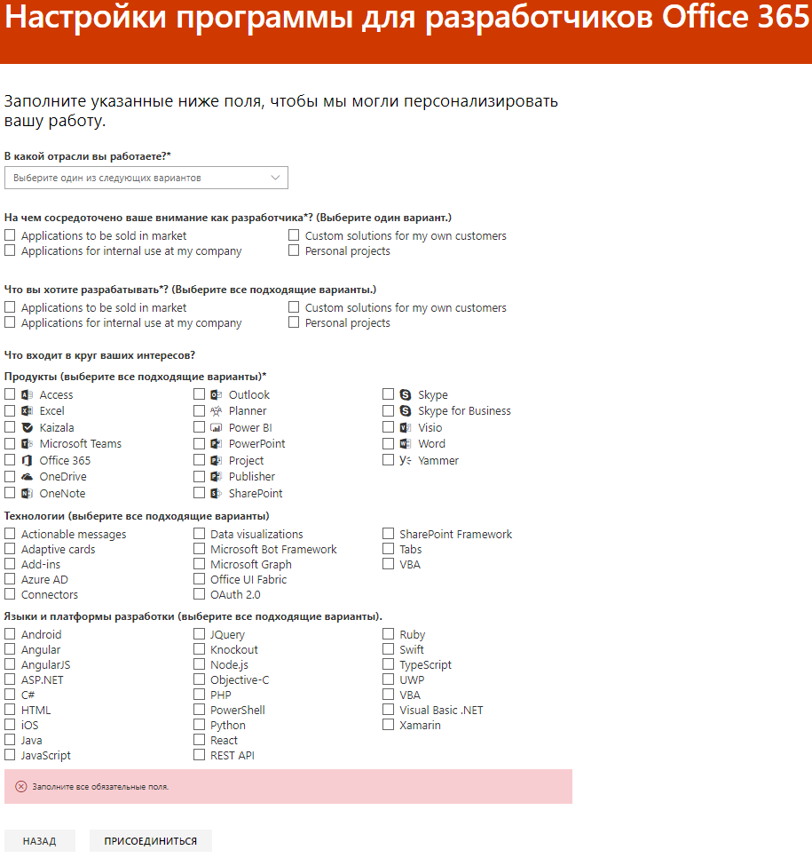
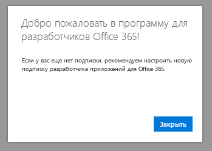

# Добро пожаловать в программу для разработчиков Office 365

Присоединяйтесь к вашим друзьям и коллегам в программе для разработчиков Office 365. Разрабатывайте решения независимо от рабочей среды с помощью подписки разработчика Office 365. Вы можете создавать решения для Microsoft Teams, надстроек Office, Microsoft Graph, SharePoint Framework, надстроек SharePoint и многого другого.

## Присоединяйтесь к программе для разработчиков Office 365

1. Перейдите на страницу [Присоединяйтесь к программе для разработчиков Office 365](https://developer.microsoft.com/office/dev-program). 

2. В правом верхнем углу выберите пункт **Войти**, чтобы выполнить вход с помощью учетной записи Майкрософт или электронной почты с поддержкой Azure Active Directory. 

  

3. После входа нажмите кнопку **Присоединиться**.

4. На странице **Регистрация в программе для разработчиков Office 365** заполните следующие поля в интерактивной форме.

  - **Контактный адрес электронной почты**
  - **Страна или регион**
  - **Организация**

  

5. Просмотрите **условия использования**. Перед тем как присоединиться, нужно установить флажок.

6. Можно установить флажок **Я хочу получать информацию, советы и предложения о программе для разработчиков Office 365**, если вы хотите узнавать от корпорации Майкрософт о новых возможностях и других обновлениях. 

7. Нажмите кнопку **Далее**.

8. На странице **Настройки программы для разработчиков Office 365** расскажите нам о своих предпочтениях, чтобы мы персонализировали интерфейс, включая:

  - отрасль, в которой вы работаете;
  - тип приложений или решения, которые вы хотите разрабатывать;
  - продукты, технологии и языки программирования, которые вас интересуют.

  

9. По завершении нажмите кнопку **Присоединиться**. На следующей странице в правом верхнем углу отобразятся ваши предпочтения, а также появится приветственное сообщение.

  

## Дальнейшие действия

- [Настройка подписки разработчика Office 365](office-365-developer-program-get-started.md). 

- После получения подписки разработчика [используйте ее](build-office-365-solutions.md) для создания нужных типов решений.

- Сведения о завершающихся подписках см. в статье [Окончание и продление срока действия подписки](subscription-expiration-and-renewal.md).

- Ответы на часто задаваемые вопросы о программе для разработчиков Office 365 см. в статье [Вопросы и ответы](office-365-developer-program-faq.md).

