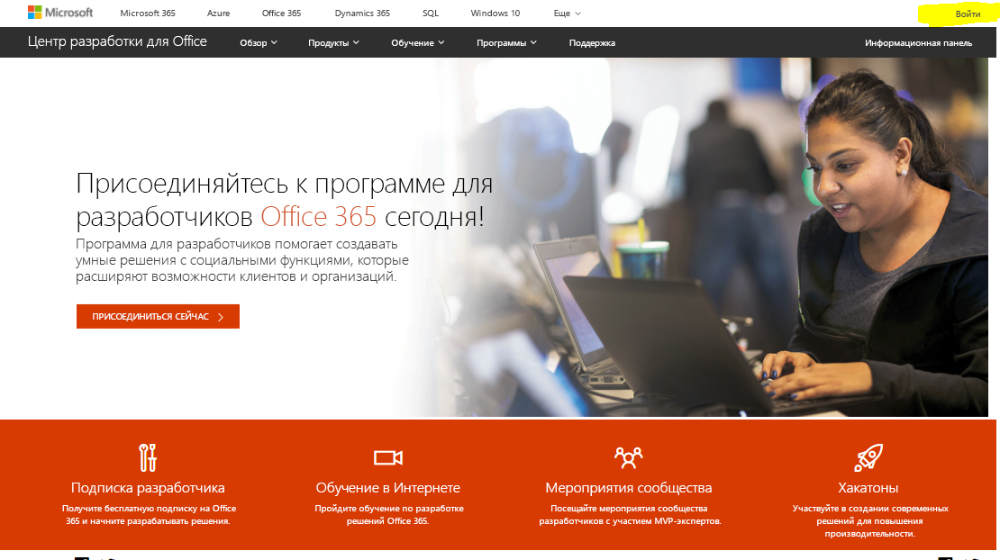
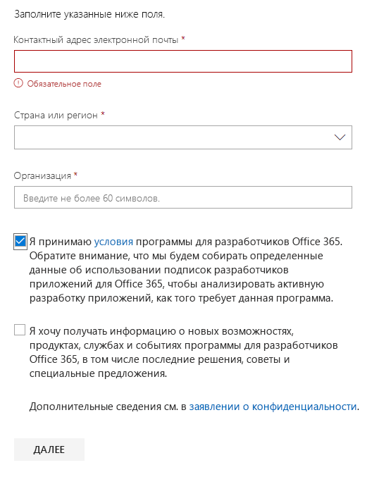
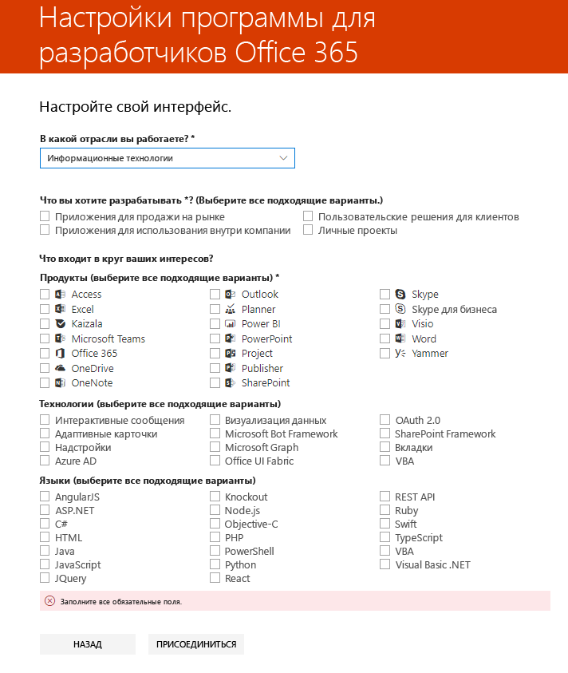

# Добро пожаловать в программу для разработчиков Office 365Welcome to the Office 365 Developer Program

Присоединяйтесь к вашим друзьям и коллегам в программе для разработчиков Office 365.Join your friends and colleagues in the Office 365 Developer Program. Разрабатывайте решения независимо от рабочей среды с помощью подписки разработчика Office 365.Use the Office 365 developer subscription to develop your solutions independent of your production environment. Вы можете создавать решения для Microsoft Teams, надстроек Office, Microsoft Graph, SharePoint Framework, надстроек SharePoint и многого другого.You can build solutions for Microsoft Teams, Office Add-ins, Microsoft Graph, SharePoint Framework, SharePoint Add-ins, and more.

## Присоединяйтесь к программе для разработчиков Office 365Join the Office 365 Developer Program

1. Перейдите на страницу [Присоединяйтесь к программе для разработчиков Office 365](https://developer.microsoft.com/office/dev-program).Go to the [Join the Office 365 Developer Program](https://developer.microsoft.com/office/dev-program) page. 

2. В правом верхнем углу выберите пункт **Войти**, чтобы выполнить вход с помощью учетной записи Майкрософт или электронной почты с поддержкой Azure Active Directory.In the upper-right corner, choose **Sign in** to sign in with your Microsoft account or Azure Active Directory-enabled email.

    > [!NOTE]
    > Запомните учетную запись, использованную для входа.Remember the account that you sign in with. С помощью этой учетной записи вы будете выполнять вход в [панель мониторинга программы для разработчиков](https://developer.microsoft.com/office/profile).You’ll sign in to the [Developer Program dashboard](https://developer.microsoft.com/office/profile) with this account. Эта учетная запись отличается от идентификатора администратора, используемого в вашей подписке Microsoft 365 для разработчиков.This account is different than the admin ID that you'll use for your Microsoft 35 developer subscription.

  

3. После входа нажмите кнопку **Присоединиться**.After signing in, choose **Join now**.

4. На странице **Регистрация в программе для разработчиков Office 365** заполните следующие поля в интерактивной форме.On the **Office 365 Developer Program Signup** page, complete the following fields in the online form:

  - **Контактный адрес электронной почты****Contact Email**
  - **Страна или регион****Country/Region**
  - **Компания****Company**

  

5. Просмотрите **условия использования**.Review the **terms and conditions**. Перед тем как присоединиться, нужно установить флажок.You'll need to select the check box before you can join.

6. Можно установить флажок **Я хочу получать информацию, советы и предложения о программе для разработчиков Office 365**, если вы хотите узнавать от корпорации Майкрософт о новых возможностях и других обновлениях.Optionally, select the **I would like to hear from the Office 365 Developer Program** check box if you want to hear from Microsoft about new capabilities and other updates. 

7. Нажмите кнопку **Далее**.Choose **Next**.

8. На странице **Настройки программы для разработчиков Office 365** расскажите нам о своих предпочтениях, чтобы мы персонализировали интерфейс, включая:On the **Office 365 Developer Program Preferences** page, tell us your preferences so we can personalize your experience, including:

  - отрасль, в которой вы работаете;The industry that you work in.
  - тип приложений или решения, которые вы хотите разрабатывать;The type of applications or solutions that you're interested in developing.
  - продукты, технологии и языки программирования, которые вас интересуют.Products, technologies, and programming languages that you're interested in.

  

9. По завершении нажмите кнопку **Присоединиться**.When you're finished, choose **Join**. На следующей странице в правом верхнем углу отобразятся ваши предпочтения, а также появится приветственное сообщение.Your preferences appear on the next page in the top right, and you receive a Welcome message.

  

## Дальнейшие действияNext steps

- [Настройка подписки разработчика Office 365](office-365-developer-program-get-started.md).[Set up an Office 365 developer subscription](office-365-developer-program-get-started.md). 

- После получения подписки разработчика [используйте ее](build-office-365-solutions.md) для создания нужных типов решений.After you have your developer subscription, [use your subscription](build-office-365-solutions.md) to build the types of solutions that you want.

- Сведения о завершающихся подписках см. в статье [Окончание и продление срока действия подписки](subscription-expiration-and-renewal.md).For information about expiring subscriptions, see [Subscription expiration and renewal](subscription-expiration-and-renewal.md).

- Ответы на часто задаваемые вопросы о программе для разработчиков Office 365 см. в статье [Вопросы и ответы](office-365-developer-program-faq.md).For frequently asked questions about the Office 365 Developer Program, see the [FAQ](office-365-developer-program-faq.md).

