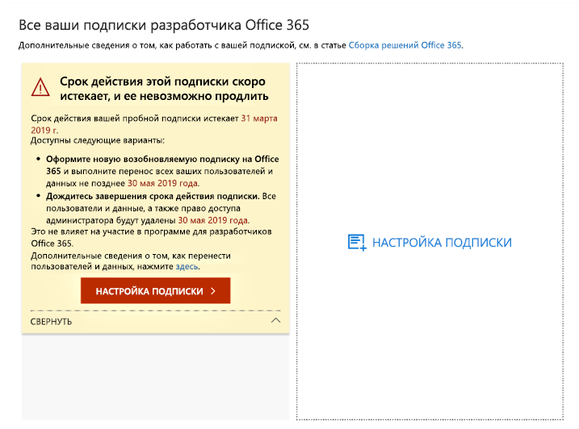
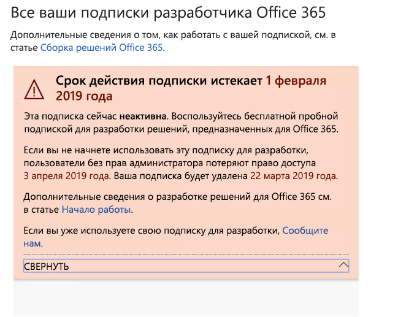

# Окончание срока действия подписки на программу для разработчиков Microsoft 365 и его продлениеMicrosoft 365 Developer Program subscription expiration and renewal

Участвуя в программе для разработчиков Microsoft 365, вы бесплатно получаете подписку для разработчиков Office 365 E3 или Microsoft 365 E5.Your Microsoft 365 Developer Program membership includes a free Office 365 E3 or Microsoft 365 E5 developer subscription. Ее можно продлить с учетом ваших действий по разработке. Но срок действия некоторых более старых подписок может закончиться.Your developer subscription is renewable based on your development activity; however, some older subscriptions do expire. В этой статье показано, какие подписки продлять можно, а также рассказано, как это сделать.This article describes the difference between renewable and non-renewable subscriptions and how to update your subscription if it expires.

## Сравнение подписок для разработчиков, которые можно и нельзя продлятьExpiring vs. renewable developer subscriptions

С запуском программы для разработчиков Microsoft 365 мы предложили соответствующие подписки на 12 месяцев, срок действия которых заканчивается без возможности продления.With the launch of the Microsoft 365 Developer Program, we offered 12-month developer subscriptions that expire and cannot be renewed. В августе 2018 г. мы начали предоставлять некоторым участникам этой программы подписки, срок действия которых можно продлить.In August 2018, we started providing renewable subscriptions to some developer program members.

Начиная с апреля 2019 г. мы предлагаем подписки на 90 дней с возможностью продления.Starting in April 2019, we offer renewable 90-day subscriptions.

Чтобы узнать, возможно ли продлить срок действия вашей подписки, перейдите на [панель мониторинга программы для разработчиков Microsoft 365](https://aka.ms/DevProgramDashboard).You can determine whether you have a renewable or non-renewable subscription by viewing your [Microsoft 365 Developer Program dashboard](https://aka.ms/DevProgramDashboard).

## Подписки без возможности продленияNon-renewable subscriptions

Если вы оформили подписку до августа 2018 г., ее невозможно продлить. На вашей панели мониторинга появится показанное ниже предупреждение.If you signed up for your subscription before August 2018, your subscription is not renewable, and you'll see the following warning on your dashboard. Подписку необходимо заменить до окончания срока действия текущей.You'll need to replace your subscription before your current one expires. В тексте предупреждения будет указано, что подписку невозможно продлить.The warning text will indicate that the subscription cannot be renewed. Кроме того, мы отправим вам по электронной почте напоминание об окончании срока действия вашей подписки.We'll also email you to remind you that your subscription is expiring.
 
 

Когда срок действия подписки закончится, появится указанное ниже предупреждение.When your subscription expires, you'll see the following warning text.

 

Чтобы заменить подписку, выберите **Настроить подписку**.To create a replacement subscription, choose **Set Up Subscription**. 

Кроме того, в новую подписку нужно будет перенести важные данные, которые необходимо сохранить.You'll also need to migrate any important data that you need to save to your new subscription. Дополнительные сведения об этом см. в разделе [Как перенести данные](#migrate-data) далее в этой статье.For details, see [How do I migrate my data?](#migrate-data) later in this topic.

## Подписки с возможностью продленияRenewable subscriptions

Если вы оформили подписку после августа 2018 г., есть вероятность, что ее можно продлить.If you signed up for your subscription after August 2018, you might have a renewable subscription. Если подписка неактивна, на вашей панели мониторинга появится указанное ниже предупреждение.If your subscription is inactive, you'll see the following warning on your dashboard. 

 

Когда срок действия подписки закончится, появится указанное ниже предупреждение.When your subscription expires, you'll see the following warning text.

 

Если вы активный разработчик, ваша подписка будет автоматически продлена на 90 дней с исходной даты завершения ее срока действия.If you're an active developer, your subscription will be renewed automatically for another 90 days from the original date of expiration. 

## Почему я не могу продлить текущую подписку?Why isn't my current subscription renewable?

Мы ввели подписки с возможностью продления в августе 2018 г.We introduced renewable subscriptions in August 2018. Если вы оформили подписку раньше, ее невозможно продлить. Нужно настроить новую подписку, когда закончится срок действия текущей.If you signed up for your subscription before then, your subscription is not renewable and you'll need to set up a new one when it expires.

## Как перенести данные, когда закончится срок действия подписки?How do I migrate my data when my subscription expires?

Сведения о переносе данных из текущей подписки в новую приведены здесь:To migrate your data from your current subscription to a new subscription, see the following resources:

- [Перенос почтовых ящиков из одного клиента в другойHow to migrate mailboxes from one tenant to another](https://docs.microsoft.com/exchange/mailbox-migration/migrate-mailboxes-across-tenants)
- [Поэтапная миграция с помощью PowerShellUse PowerShell to perform a staged migration](https://docs.microsoft.com/office365/enterprise/powershell/use-powershell-to-perform-a-staged-migration-to-office-365)
- [Переход с одной подписки на другую без сторонних средствMigration from one subscription to another without third party](https://social.technet.microsoft.com/Forums/en-US/ee507441-eb91-4b0a-ba6c-5bd9bb8c71b1/migration-from-one-o365-tenant-to-another-o365-without-third-party?forum=onlineservicesmigrationandcoexistence)

## Как узнать, удалена ли моя подписка?How do I know if my subscription was deleted?

Если подписка удалена, на панели мониторинга появится уведомление о том, что подписка и ее ИД удалены, как показано на снимке экрана ниже.When your subscription is deleted, you will see a notification on your dashboard that the subscription and its ID were deleted, as shown in the following screenshot. 

 

## См. такжеSee also

- [Присоединяйтесь к программе для разработчиков Microsoft 365Join the Microsoft 365 Developer Program](microsoft-365-developer-program.md)
- [Настройка подписки разработчика Microsoft 365Set up a Microsoft 365 developer subscription](microsoft-365-developer-program-get-started.md)
- [Создание решений для Microsoft 365 с помощью подпискиUse your subscription to build Microsoft 365 solutions](build-microsoft-365-solutions.md)
- [Вопросы и ответы о программе для разработчиков Microsoft 365Microsoft 365 Developer Program FAQ](microsoft-365-developer-program-faq.md)

