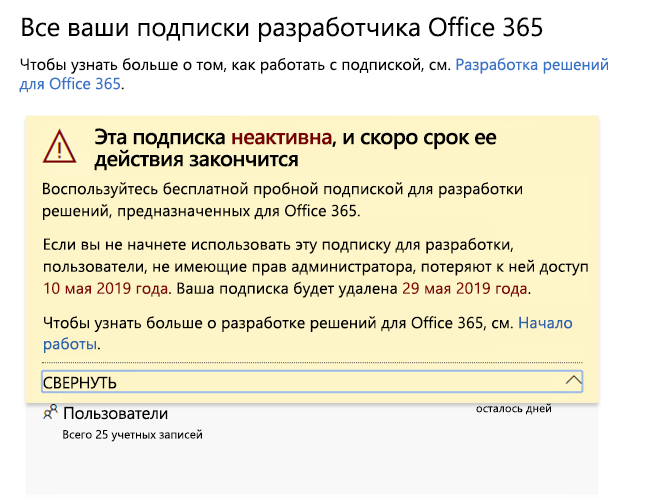
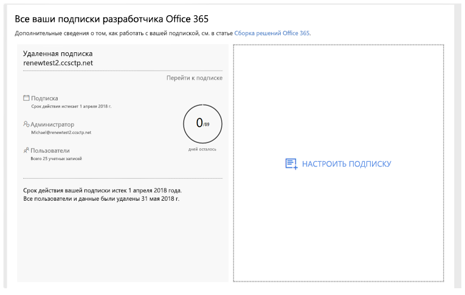

# Окончание срока действия подписки на программу для разработчиков Office 365 и его продление

Участвуя в программе для разработчиков Office 365, вы бесплатно получаете подписку для разработчиков Office 365. Ее можно продлить с учетом ваших действий по разработке. Но срок действия некоторых более старых подписок может закончиться. В этой статье показано, какие подписки продлять можно, а также рассказано, как это сделать.

## Сравнение подписок для разработчиков, которые можно и нельзя продлять

С запуском программы для разработчиков Office 365 мы предложили соответствующие подписки на 12 месяцев, срок действия которых заканчивается без возможности продления. В августе 2018 г. мы начали предоставлять некоторым участникам этой программы подписки, срок действия которых можно продлить.

Начиная с апреля 2019 г. мы предлагаем подписки на 90 дней с возможностью продления.

Чтобы узнать, возможно ли продлить срок действия вашей подписки, перейдите на [панель мониторинга программы для разработчиков Office 365](https://developer.microsoft.com/ru-RU/office/profile).

## Подписки без возможности продления

Если вы оформили подписку до августа 2018 г., ее невозможно продлить. На вашей панели мониторинга появится показанное ниже предупреждение. Подписку необходимо заменить до окончания срока действия текущей. В тексте предупреждения будет указано, что подписку невозможно продлить. Кроме того, мы отправим вам по электронной почте напоминание об окончании срока действия вашей подписки.
 
 

Когда срок действия подписки закончится, появится указанное ниже предупреждение.

 

Чтобы заменить подписку, выберите **Настроить подписку**. 

Кроме того, в новую подписку нужно будет перенести важные данные, которые необходимо сохранить. Дополнительные сведения об этом см. в разделе [Как перенести данные](#migrate-data) далее в этой статье.

## Подписки с возможностью продления

Если вы оформили подписку после августа 2018 г., есть вероятность, что ее можно продлить. Если подписка неактивна, на вашей панели мониторинга появится указанное ниже предупреждение. 

 

Когда срок действия подписки закончится, появится указанное ниже предупреждение.

 

Если вы активный разработчик, ваша подписка будет автоматически продлена на 90 дней с исходной даты завершения ее срока действия. 

## Почему я не могу продлить текущую подписку?

Мы ввели подписки с возможностью продления в августе 2018 г. Если вы оформили подписку раньше, ее невозможно продлить. Нужно настроить новую подписку, когда закончится срок действия текущей.

## Как перенести данные, когда закончится срок действия подписки?

Сведения о переносе данных из текущей подписки в новую приведены здесь:

- [Перенос почтовых ящиков из одного клиента Office 365 в другой](https://docs.microsoft.com/exchange/mailbox-migration/migrate-mailboxes-across-tenants)
- [Поэтапная миграция в Office 365 с помощью PowerShell](https://docs.microsoft.com/office365/enterprise/powershell/use-powershell-to-perform-a-staged-migration-to-office-365)
- [Переход с одной подписки Office 365 на другую без сторонних средств](https://social.technet.microsoft.com/Forums/en-US/ee507441-eb91-4b0a-ba6c-5bd9bb8c71b1/migration-from-one-o365-tenant-to-another-o365-without-third-party?forum=onlineservicesmigrationandcoexistence)

## Как узнать, удалена ли моя подписка?

Если подписка удалена, на панели мониторинга появится уведомление о том, что подписка и ее ИД удалены, как показано на снимке экрана ниже. 

 

## См. также

- [Присоединяйтесь к программе для разработчиков Office 365](office-365-developer-program.md)
- [Настройка подписки разработчика Office 365](office-365-developer-program-get-started.md)
- [Создание решений для Office 365 с помощью подписки](build-office-365-solutions.md)
- [Вопросы и ответы о программе для разработчиков Office 365](office-365-developer-program-faq.md)

